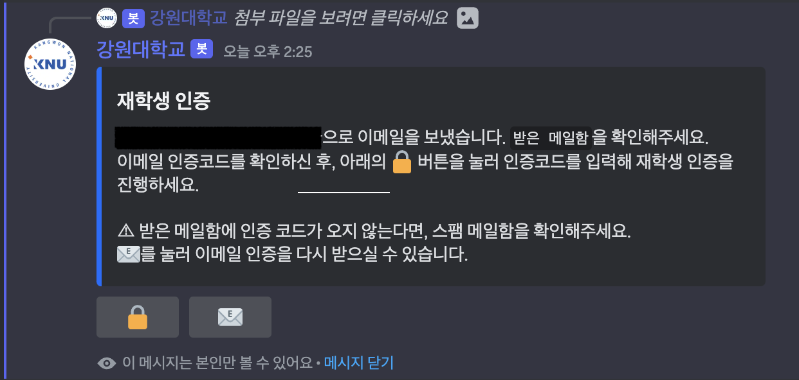

## Kangwon Discord Manager
강원대학교 프로그래밍 커뮤니티을 보다 더 효율적인 관리를 위해 개발한 디스코드 봇입니다.

### 재학생 인증 시스템
강원대학교 재학생만 이용할 수 있도록 재학생 인증 시스템을 만들었습니다.
* 대학교 이메일(`@kangwon.ac.kr`)을 이용한 재학생 인증
* 티켓 기능을 활용한 수동적 인증

새롭게 들어온 사용자는 학내 이메일 또는 학생증이나 재학증명서를 관리자에게 보여줌으로 재학생 인증을 하게 됩니다.  
이메일 인증과 서류로 재학생 인증하는 시스템과 별도로 [K-cloud](https://kcloud.kangwon.ac.kr/)를 활용한 재학생 인증 시스템도 만들어 보고 싶습니다.
<table>
    <thead>
        <tr>
            <th>/</th>
            <th>1. 인증 방식 선택</th>
            <th>2. 재학생 인증</th>
            <th>3. 멤버 역할 부여</th>
        </tr>
    </thead>
    <tbody>
        <tr>
            <td>이메일</td>
            <td rowspan="2"></td>
            <td> 이메일에 전송된 코드 확인</td>
            <td rowspan="2"></td>
        </tr>
        <tr>
            <td>서류</td>
            <td> 재학증명서, 학생증으로 재학생 인증</td>
        </tr>
    </tbody>
</table>

아래의 이미지는 `@kangwon.ac.kr`로 보내진 이메일 내용입니다. 
소스코드는 [여기](assets/verification.html)서 확인하실 수 있습니다.

### 그룹 스터디 참가 유/무 표시
그룹 스터디을 신청한 멤버 순서를 확인하기 위해, 사용자가 포스트이 반응을 입력하면 `@맨션 님이 그룹 스터디에 참여합니다!`라는 코멘트와 함께 포스트에서 맨션합니다. 
discord.py의 `on_reaction_add` 이벤트에서는 포스트의 반응 유/무를 확인할 수 없어서 `on_raw_reaction_add`를 사용하였습니다.

### 기숙사 식당 & 학생 식당 식단표 제공
학생생활관과 강원대학교 웹사이트를 접속할 필요 없이, 한 번에 기숙사 식당과 학생 식당의 식단표를 제공받기 위해 기능을 제작하였습니다. 
`beautifulSoup`를 활용한 크롤링을 기반으로 제작하였습니다. 
아래의 버튼을 통해 다른 날짜의 식단표를 확인하거나, 다음 식단은 언제인지 빨간색 버튼으로 표시함으로 확인할 수 있습니다.  
Embed의 footer를 사용하여 다음 식단의 운영 시간을 표시하였습니다. 
만약 15시 20분에 기숙사 식단을 조회하면 저녁 식단은 언제인지 사용자에게 제공합니다.  
기숙사 식단은 아침/점심/저녁으로 구성되어 있어서 한 번에 제공하였으나,
학생 식당은 건물 별로 식당이 구성되어 있어 버튼으로 아침/점심/저녁으로 나누어  식당별 식단표를 사용자에게 제공합니다.

<table>
    <thead>
        <tr>
            <th>새롬관(기숙사) BTL1</th>
            <th>이롬관(기숙사) BTL2</th>
            <th>천지관 (학생 식당)</th>
            <th>백록관 (학생 식당)</th>
            <th>두리관 (학생 식당)</th>
        </tr>
    </thead>
    <tbody>
        <tr>
            <td></td>
            <td></td>
            <td></td>
            <td></td>
            <td></td>
        </tr>
    </tbody>
</table>